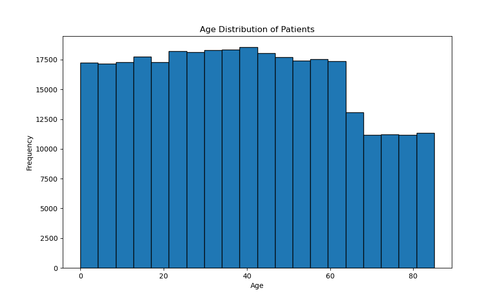
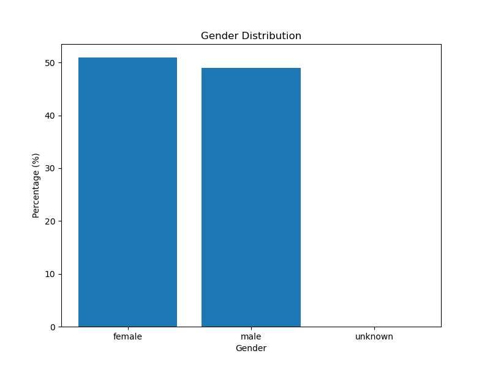

Excercise 1
Please import the following before run the code.
```python
import xml.etree.ElementTree as ET
import matplotlib.pyplot as plt
from collections import Counter
```

1a.
```python
# Load and parse XML
tree = ET.parse('pset1-patients.xml')
root = tree.getroot()

# Extract patient data
patients = []
patients_node = root.find('patients')

for patient in patients_node.findall('patient'):
    patients.append({
        'name': patient.get('name', 'Unknown'),
        'age': float(patient.get('age', 0)),
        'gender': patient.get('gender', 'Unknown')
    })

ages = [p['age'] for p in patients]
plt.figure(figsize=(10, 6))
plt.hist(ages, bins=20, edgecolor='black')
plt.xlabel('Age')
plt.ylabel('Frequency')
plt.title('Age Distribution of Patients')
plt.savefig('age_distribution.png')
plt.close()
```



There is no patient share the same exact age. Because the following code returns 'None'.
```python
age_counts = Counter(ages)
duplicates = {age: count for age, count in age_counts.items() if count > 1}
print(f"Patients with same age: {duplicates if duplicates else 'None'}")
```


1b
```python
genders = [p['gender'] for p in patients]
gender_counts = Counter(genders)
total = len(genders)
gender_percentages = {k: (v/total)*100 for k, v in gender_counts.items()}

plt.figure(figsize=(8, 6))
plt.bar(gender_percentages.keys(), gender_percentages.values())
plt.xlabel('Gender')
plt.ylabel('Percentage (%)')
plt.title('Gender Distribution')
plt.savefig('gender_distribution.png')
plt.close()

print(f"Gender encoding: {dict(gender_counts)}")
print(f"Gender percentages: {gender_percentages}")
```

Gender Encoding: strings ('female', 'male', 'unknown')
Categories:
female: 165,293 (50.96%)
male: 158,992 (49.02%)
unknown: 72 (0.02%)


1c
```python
sorted_patients = sorted(patients, key=lambda x: x['age'])
print(f"Oldest patient: {sorted_patients[-1]['name']}, Age: {sorted_patients[-1]['age']}")
```
Oldest patient: Monica Caponera, Age: 84.99855742449432


1d
```python
# 1d.
max_age = max(ages)
second_max = max(age for age in ages if age < max_age)
second_oldest = next(p for p in patients if p['age'] == second_max)
print(f"Second oldest: {second_oldest['name']}, Age: {second_oldest['age']}")
```
Second oldest: Raymond Leigh, Age: 84.9982928781625
Sorting is advantageous when Multiple queries. If need to find the kth oldest patient multiple times (2nd, 3rd, 4th oldest, etc.), sorting once O(n log n) + accessing O(1) is better than running O(n) each time.


1e
```python
# 1e.
def binary_search(arr, target):
    left, right = 0, len(arr) - 1
    while left <= right:
        mid = (left + right) // 2
        if arr[mid]['age'] == target:
            return mid
        elif arr[mid]['age'] < target:
            left = mid + 1
        else:
            right = mid - 1
    return -1

target_age = 41.5
idx = binary_search(sorted_patients, target_age)
print(f"Patient aged 41.5: {sorted_patients[idx]['name']}")
```
Patient aged 41.5: John Braswell


1f
```python
target_age = 41.5
idx = binary_search(sorted_patients, target_age)

count = len(sorted_patients) - idx
print(f"Patients >= {target_age} years old: {count}")
```
Patients >= 41.5 years old: 150471


1g
```python
def count_age_range(low_age, high_age):
    # Binary search for boundaries in sorted ages
    sorted_ages = sorted(ages)
    
    # Find first index >= low_age
    left = 0
    right = len(sorted_ages)
    while left < right:
        mid = (left + right) // 2
        if sorted_ages[mid] < low_age:
            left = mid + 1
        else:
            right = mid
    start_idx = left
    
    # Find first index >= high_age
    left = 0
    right = len(sorted_ages)
    while left < right:
        mid = (left + right) // 2
        if sorted_ages[mid] < high_age:
            left = mid + 1
        else:
            right = mid
    end_idx = left
    
    return end_idx - start_idx

# Test cases
print(f"tests results:")
print(f"[30, 40): {count_age_range(30, 40)}")
print(f"[40, 50): {count_age_range(40, 50)}")
print(f"[25, 35): {count_age_range(25, 35)}")
```
tests results:
[30, 40): 43189
[40, 50): 42525
[25, 35): 42857


