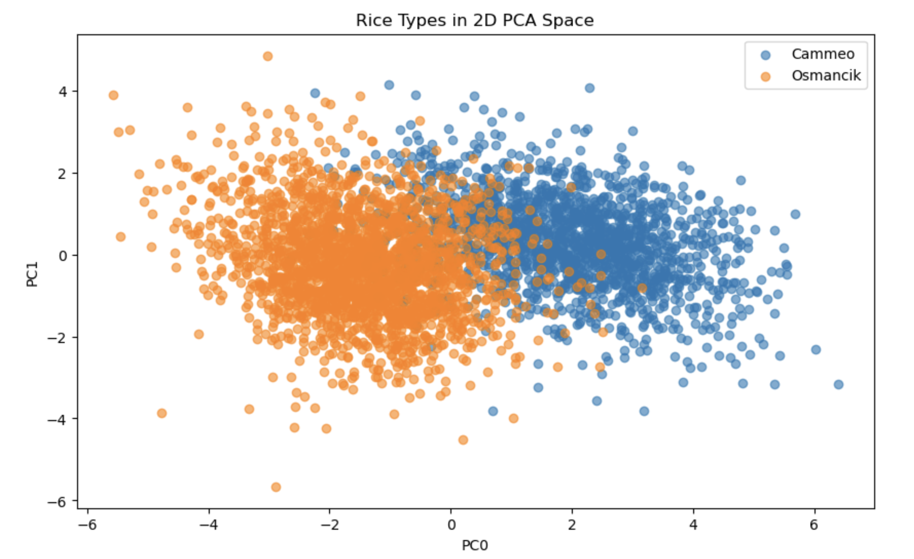
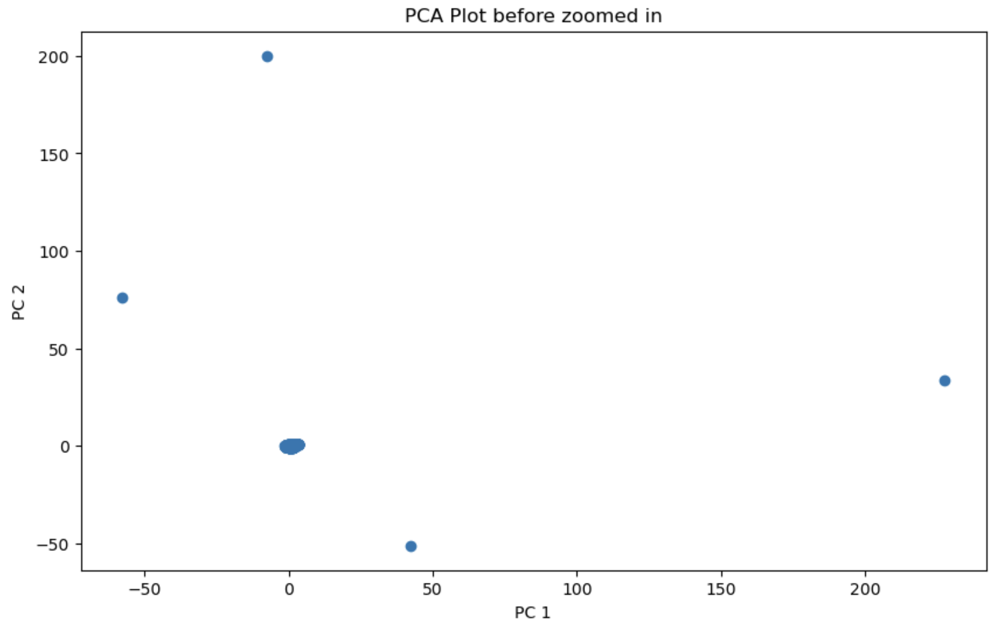
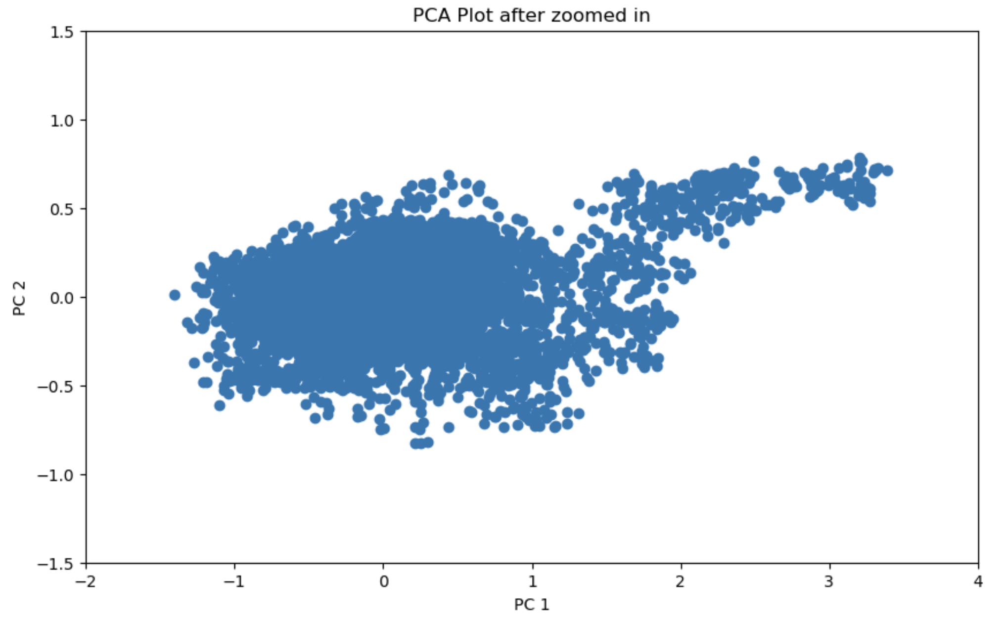
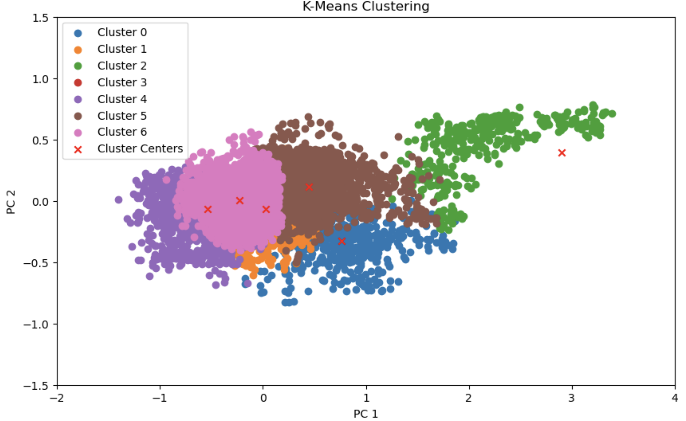
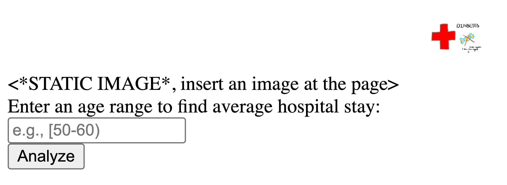
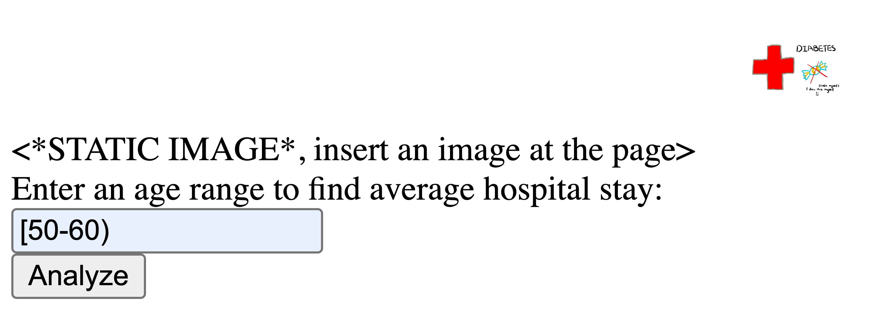
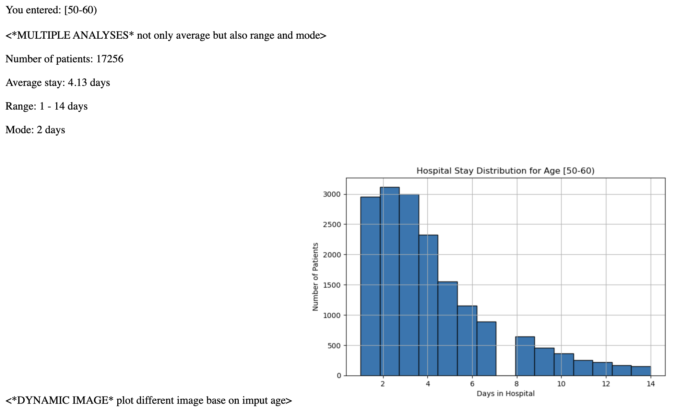

NetID: df753

Excercise 1

This is not a clean URL as it shows the .py extension.
```python
import requests

a, b = 0.5, 0.5
lr = 0.01
h = 1e-5

for i in range(1000):
    e = float(requests.get(f"http://ramcdougal.com/cgi-bin/error_function.py?a={a}&b={b}", 
                           headers={"User-Agent": "MyScript"}).text)
    ea = float(requests.get(f"http://ramcdougal.com/cgi-bin/error_function.py?a={a+h}&b={b}", 
                            headers={"User-Agent": "MyScript"}).text)
    eb = float(requests.get(f"http://ramcdougal.com/cgi-bin/error_function.py?a={a}&b={b+h}", 
                            headers={"User-Agent": "MyScript"}).text)
    
    grad_a = (ea - e) / h
    grad_b = (eb - e) / h
    
    a_new = a - lr * grad_a
    b_new = b - lr * grad_b
    
    if abs(a_new - a) < 1e-6 and abs(b_new - b) < 1e-6:
        break
    
    a, b = a_new, b_new

print(f"a={a:.3f}, b={b:.3f}, error={e:.3f}")
```
a=0.216, b=0.689, error=1.100

The gradient is estimated using numerical differentiation with finite differences. Since the error function is a black-box API, I approximate the partial derivative for each parameter by computing (f(x+h) - f(x))/h. For parameter a, I keep b constant and measure the error change when a increases by h. Similarly for b. This gives the gradient vector, then I subtract it to descend toward the minimum.

Learning rate (0.01): Small enough for stable convergence without overshooting.

Step size h (1e-5): Balances accurate derivative approximation with numerical stability in floating-point arithmetic.

Tolerance (1e-6): Stops when parameter changes are negligible.
```python
a2, b2 = 0.7, 0.3

for i in range(1000):
    e2 = float(requests.get(f"http://ramcdougal.com/cgi-bin/error_function.py?a={a2}&b={b2}", 
                            headers={"User-Agent": "MyScript"}).text)
    ea2 = float(requests.get(f"http://ramcdougal.com/cgi-bin/error_function.py?a={a2+h}&b={b2}", 
                             headers={"User-Agent": "MyScript"}).text)
    eb2 = float(requests.get(f"http://ramcdougal.com/cgi-bin/error_function.py?a={a2}&b={b2+h}", 
                             headers={"User-Agent": "MyScript"}).text)
    
    a2_new = a2 - lr * (ea2 - e2) / h
    b2_new = b2 - lr * (eb2 - e2) / h
    
    if abs(a2_new - a2) < 1e-6 and abs(b2_new - b2) < 1e-6:
        break
    
    a2, b2 = a2_new, b2_new

# Compare with previous results
if e < e2:
    print(f"gm: a={a:.3f}, b={b:.3f}, error={e:.3f}")
    print(f"lm: a={a2:.3f}, b={b2:.3f}, error={e2:.3f}")
else:
    print(f"gm: a={a2:.3f}, b={b2:.3f}, error={e2:.3f}")
    print(f"lm: a={a:.3f}, b={b:.3f}, error={e:.3f}")
```
Global minimum: a=0.712, b=0.169, error=1.000

Local minimum: a=0.216, b=0.689, error=1.100

Without prior knowledge of how many minima exist, I may use a multi-start approach by running gradient descent from numerous randomly selected starting points distributed throughout the [0,1] × [0,1] parameter space. After running, I will group the results by their final (a,b) coordinates to identify distinct minima.

Exercise 2
```python
import numpy as np

def align(seq1, seq2, match=1, gap_penalty=1, mismatch_penalty=1):
    m, n = len(seq1), len(seq2)
    H = np.zeros((m + 1, n + 1), dtype=int)
    
    for i in range(1, m + 1):
        for j in range(1, n + 1):
            match_score = H[i-1, j-1] + (match if seq1[i-1] == seq2[j-1] else -mismatch_penalty)
            delete = H[i-1, j] - gap_penalty
            insert = H[i, j-1] - gap_penalty
            H[i, j] = max(0, match_score, delete, insert)
    
    # Find maximum score
    max_score = np.max(H)
    max_pos = np.unravel_index(np.argmax(H), H.shape)
    
    # Backtrack
    align1, align2 = '', ''
    i, j = max_pos
    while i > 0 and j > 0 and H[i, j] > 0:
        score = H[i, j]
        diag = H[i-1, j-1]
        up = H[i-1, j]
        left = H[i, j-1]
        
        if score == diag + (match if seq1[i-1] == seq2[j-1] else -mismatch_penalty):
            align1 = seq1[i-1] + align1
            align2 = seq2[j-1] + align2
            i -= 1
            j -= 1
        elif score == up - gap_penalty:
            align1 = seq1[i-1] + align1
            align2 = '-' + align2
            i -= 1
        else:
            align1 = '-' + align1
            align2 = seq2[j-1] + align2
            j -= 1
    
    return align1, align2, max_score
```
```python
# 1
seq1, seq2, score = align('tgcatcgagaccctacgtgac', 'actagacctagcatcgac')
print("Test 1 (default parameters):")
print(f"seq1 = {seq1}")
print(f"seq2 = {seq2}")
print(f"score = {score}\n")

# 2
seq1, seq2, score = align('tgcatcgagaccctacgtgac', 'actagacctagcatcgac', gap_penalty=2)
print("Test 2 (gap_penalty=2):")
print(f"seq1 = {seq1}")
print(f"seq2 = {seq2}")
print(f"score = {score}\n")

# 3
seq1, seq2, score = align('tgcatcgagaccctacgtgac', 'actagacctagcatcgac', match=2)
print("Test 3 (match=2):")
print(f"seq1 = {seq1}")
print(f"seq2 = {seq2}")
print(f"score = {score}\n")

# 4
seq1, seq2, score = align('tgcatcgagaccctacgtgac', 'actagacctagcatcgac', mismatch_penalty=2)
print("Test 4 (mismatch_penalty=2):")
print(f"seq1 = {seq1}")
print(f"seq2 = {seq2}")
print(f"score = {score}\n")
```
Test 1 (default parameters):
seq1 = agacccta-cgt-gac,
seq2 = aga-cctagcatcgac,
score = 8

Test 2 (gap_penalty=2):
seq1 = gcatcga,
seq2 = gcatcga,
score = 7

Test 3 (match=2):
seq1 = atcgagacccta-cgt-gac,
seq2 = a-ctaga-cctagcatcgac,
score = 22

Test 4 (mismatch_penalty=2):
seq1 = gcatcga,
seq2 = gcatcga,
score = 7

Test 1 produces a balanced alignment where matches are rewarded and gaps/mismatches are equally penalized. Test 2 makes gaps more expensive, resulting in alignments with fewer gaps but possibly more mismatches. The score is lower compared to test 1 because gaps cost more. Test 3 rewards matches more, increasing the overall score for the same alignment pattern. Test 4 makes mismatches more expensive, favoring alignments with more gaps over mismatches (score decreases).


Exercise 3
```python
import pandas as pd
import numpy as np
from sklearn.decomposition import PCA
import matplotlib.pyplot as plt
from sklearn.model_selection import train_test_split
from sklearn.metrics import confusion_matrix
```
```python
data = pd.read_excel('Rice_Cammeo_Osmancik.xlsx')
my_cols = data.columns[:-1]
mean = data[my_cols].mean()
std = data[my_cols].std()
data[my_cols] = (data[my_cols] - mean) / std
```
```python
pca = PCA(n_components=2)
data_reduced = pca.fit_transform(data[my_cols])
pc0 = data_reduced[:, 0]
pc1 = data_reduced[:, 1]
```
```python
plt.figure(figsize=(10, 6))
for rice_type in data['Class'].unique():
    mask = data['Class'] == rice_type
    plt.scatter(pc0[mask], pc1[mask], label=rice_type, alpha=0.6)
plt.xlabel('PC0')
plt.ylabel('PC1')
plt.legend()
plt.title('Rice Types in 2D PCA Space')
plt.show()
```

The graph suggests that k-nearest neighbors would be moderately effective for classifying rice types in this 2-dimensional PCA space. While the two varieties show somewhat distinct clustering tendencies, there is substantial overlap throughout the central region. This overlap means that k-NN will perform reasonably well in areas where the classes are clearly separated, but accuracy will suffer for points in the mixed central zone.
```python
class QuadTree:
    def __init__(self, points, classes, max_points=10):
        self.points = points
        self.classes = classes
        self.max_points = max_points
        self.children = None
        
        if len(points) > max_points:
            self._subdivide()
    
    def _subdivide(self):
        x_mid = (self.points[:, 0].min() + self.points[:, 0].max()) / 2
        y_mid = (self.points[:, 1].min() + self.points[:, 1].max()) / 2
        
        masks = [
            (self.points[:, 0] <= x_mid) & (self.points[:, 1] <= y_mid),
            (self.points[:, 0] > x_mid) & (self.points[:, 1] <= y_mid),
            (self.points[:, 0] <= x_mid) & (self.points[:, 1] > y_mid),
            (self.points[:, 0] > x_mid) & (self.points[:, 1] > y_mid)
        ]
        
        self.children = []
        for mask in masks:
            if mask.sum() > 0:
                self.children.append(QuadTree(self.points[mask], self.classes[mask], self.max_points))
    
    def contains(self, x, y):
        x_min, x_max = self.points[:, 0].min(), self.points[:, 0].max()
        y_min, y_max = self.points[:, 1].min(), self.points[:, 1].max()
        return x_min <= x <= x_max and y_min <= y <= y_max
    
    def all_points(self):
        if self.children is None:
            return self.points, self.classes
        all_pts = []
        all_cls = []
        for child in self.children:
            pts, cls = child.all_points()
            all_pts.append(pts)
            all_cls.append(cls)
        return np.vstack(all_pts), np.concatenate(all_cls)
```
```python
def knn_classify(tree, x, y, k):
    def find_containing_tree(tree, x, y):
        if tree.children is None:
            return tree
        for child in tree.children:
            if child.contains(x, y):
                return find_containing_tree(child, x, y)
        return tree
    
    start_tree = find_containing_tree(tree, x, y)
    
    def search_radius(tree, x, y, radius):
        points, classes = tree.all_points()
        x_min, x_max = points[:, 0].min(), points[:, 0].max()
        y_min, y_max = points[:, 1].min(), points[:, 1].max()
        
        if (x - radius > x_max or x + radius < x_min or 
            y - radius > y_max or y + radius < y_min):
            return [], []
        
        distances = np.sqrt((points[:, 0] - x)**2 + (points[:, 1] - y)**2)
        within = distances <= radius
        return points[within], classes[within]
    
    def get_all_within_radius(tree, x, y, radius):
        if tree.children is None:
            return search_radius(tree, x, y, radius)
        
        all_pts = []
        all_cls = []
        pts, cls = search_radius(tree, x, y, radius)
        if len(pts) > 0:
            all_pts.append(pts)
            all_cls.append(cls)
        
        for child in tree.children:
            pts, cls = get_all_within_radius(child, x, y, radius)
            if len(pts) > 0:
                all_pts.append(pts)
                all_cls.append(cls)
        
        if len(all_pts) == 0:
            return np.array([]).reshape(0, 2), np.array([])
        return np.vstack(all_pts), np.concatenate(all_cls)
    
    current_tree = start_tree
    while True:
        points, classes = current_tree.all_points()
        if len(points) >= k:
            break
        if hasattr(current_tree, '_parent'):
            current_tree = current_tree._parent
        else:
            points, classes = tree.all_points()
            break
    
    distances = np.sqrt((points[:, 0] - x)**2 + (points[:, 1] - y)**2)
    min_i = np.argpartition(distances, min(k, len(distances)-1))[:k]
    nearest_classes = classes[min_i]
    
    return pd.Series(nearest_classes).mode()[0]
```
```python
X = np.column_stack([pc0, pc1])
y = data['Class'].values

X_train, X_test, y_train, y_test = train_test_split(X, y, test_size=0.3, random_state=42)
tree = QuadTree(X_train, y_train)
```
```python
predictions_k1 = [knn_classify(tree, x, y, 1) for x, y in X_test]
cm_k1 = confusion_matrix(y_test, predictions_k1)
print(cm_k1)
```
Confusion Matrix (k=1):

[[445  73]

 [ 54 571]]
 ```python
predictions_k5 = [knn_classify(tree, x, y, 5) for x, y in X_test]
cm_k5 = confusion_matrix(y_test, predictions_k5)
print(cm_k5)
```
Confusion Matrix (k=5):

[[467  51]

 [ 43 582]]

For k=1, the classifier achieved 445 correct Cammeo predictions and 571 correct Osmancik predictions, with 73 Cammeo samples misclassified as Osmancik and 54 Osmancik samples misclassified as Cammeo, yielding an accuracy of approximately 88.9%. For k=5, performance improved slightly with 467 correct Cammeo predictions and 582 correct Osmancik predictions, while misclassifications decreased to 51 and 43 respectively, achieving about 91.7% accuracy. The improvement from k=1 to k=5 demonstrates that considering more neighbors leads to more stable predictions, perhaps due to less sensitivity to noise.


Exercise 4
```python
import pandas as pd
import numpy as np
from sklearn.preprocessing import StandardScaler
from sklearn.decomposition import PCA
from sklearn.cluster import KMeans
import matplotlib.pyplot as plt
```
```python
data = pd.read_csv('eeg-eye-state.csv')
data = data.drop(columns=["eyeDetection"])
```
```python
scaler = StandardScaler()
data_standardized = scaler.fit_transform(data)
```
```python
pca = PCA(n_components=14)
data_pca = pca.fit_transform(data_standardized)

plt.figure(figsize=(10, 6))
plt.scatter(data_pca[:, 0], data_pca[:, 1])
plt.xlabel('PC 1')
plt.ylabel('PC 2')
plt.title('PCA Plot before zoomed in')
plt.show()
```

```python
plt.figure(figsize=(10, 6))
plt.scatter(data_pca[:, 0], data_pca[:, 1])
plt.xlabel('PC 1')
plt.ylabel('PC 2')
plt.title('PCA Plot after zoomed in')
plt.xlim(-2, 4)
plt.ylim(-1.5, 1.5)
plt.show()
```

```python
kmeans = KMeans(n_clusters=7, init='random', random_state=42)
clusters = kmeans.fit_predict(data_pca)

centers_pca = kmeans.cluster_centers_

plt.figure(figsize=(10, 6))
for i in range(7):
    mask = clusters == i
    plt.scatter(data_pca[mask, 0], data_pca[mask, 1], label=f'Cluster {i}')
plt.scatter(centers_pca[:, 0], centers_pca[:, 1], c='red', marker='x', label='Cluster Centers')
plt.xlabel('PC 1')
plt.ylabel('PC 2')
plt.title('K-Means Clustering')
plt.xlim(-2, 4)
plt.ylim(-1.5, 1.5)
plt.legend()
plt.show()
```

Can only see 6 clusters because two of the cluster centers converged to nearly identical positions during the k-means algorithm.

The brown region in the middle has high density, so multiple centers converged there to minimize within-cluster variance. The blue region on the left may be more spread out with lower density, so k-means didn't place a center directly there. (Explained based on the given figure not my figure)

Making points smaller helps reduce overplotting and makes the structure clearer, but the underlying issue remains the same. The clusters still overlap and are still non-convex.

By repeat the k-mean clustering several times, I see (1) different numbers of visible clusters, and (2) different positions of cluster centers.


Exercise 5

I have watched the video and asked the questions I had.

Robert McDougal presents the lecture.

Flask is the framework demonstrated.

Classical servers serve static HTML files from folders. Flask differs by enabling dynamic content generation, e.g. it can process URL parameters, execute Python functions to calculate results and etc.

Access Developer Tools through the browser menu can inspect page elements and view the console for JavaScript errors and log messages.

The app.route decorator maps URLs to Python functions. For example, @app.route('/add/<int:a>/<int:b>') captures integers from the URL and passes them as arguments to the function, allowing one to build API endpoints that process input and return results.


Exercise 6

Usage of files:

server.py: The main Flask application file that defines the web server routes and logic. It creates the Flask app and defines two routes: “/“, and "/analyze".

index.html: HTML template displays a form where users can input text. It uses a POST method to submit data to the "/analyze" route.

analyze.html: Displays the analysis results. Uses Jinja2 template variables ({{ usertext }} and {{ analysis }}) to show the original input and the character frequency analysis.

The server.py uses render_template() to render the HTML templates. When users submit the form in index.html, Flask routes the POST request to the analyze() function, which processes the text using Counter, then renders analyze.html with the results.


For my dataset:

Question: What is the average length of hospital stay for patients in a specific age group?
Input: The user will enter an age range (e.g. "50-60").
Output: The system will return the average time in hospital (count by days) for patients in that age group.
How to determine response: I will load the diabetes dataset CSV file, filter rows where the age column matches the input age range, extract the "time_in_hospital" column, calculate the mean value, and return the result showing the average number of days along with the count of patients in that age group.

```python
import urllib.request
import zipfile

urllib.request.urlretrieve("https://archive.ics.uci.edu/ml/machine-learning-databases/00296/dataset_diabetes.zip", "dataset_diabetes.zip")
zipfile.ZipFile("dataset_diabetes.zip").extractall(".")
```
```python
open("templates/index.html", "w").write("""<html>
<body>
<*STATIC IMAGE*, insert an image at the page>

<br>
Enter an age range to find average hospital stay:<br>
<form action="/analyze" method="POST">
<input type="text" name="agerange" placeholder="e.g., [50-60)">
<br>
<input type="submit" value="Analyze">
</form>
</body>
</html>""")
```
```python
open("templates/analyze.html", "w").write("""<html>
<body>
You entered: {{ agerange }}<br><br>

<*ERROR HANDLING* give red color>
<p style="color:red">{{ error }}</p>

<*MULTIPLE ANALYSES* not only average but also range and mode>
<p>Number of patients: {{ n }}</p>
<p>Average stay: {{ avg }} days</p>
<p>Range: {{ min }} - {{ max }} days</p>
<p>Mode: {{ mode }} days</p>
<*DYNAMIC IMAGE* plot different image base on imput age>


<br><br>
<a href="/">Back</a>
</body>
</html>""")
```
``` python
import os
os.makedirs("templates", exist_ok=True)
os.makedirs("static", exist_ok=True)
# then I put in an image named 'icon.png" inside the folder 'static'
```
```python
open("server.py", "w").write("""from flask import Flask, render_template, request
import pandas as pd
import matplotlib
matplotlib.use('Agg')
import matplotlib.pyplot as plt

app = Flask(__name__)

@app.route("/")
def index():
    return render_template("index.html")

@app.route("/analyze", methods=["POST"])
def analyze():
    agerange = request.form["agerange"]
    df = pd.read_csv("dataset_diabetes/diabetic_data.csv")
    filtered = df[df["age"] == agerange]
    
    #ERROR HANDLING (tell no patient in the given range)
    if len(filtered) == 0:
        return render_template("analyze.html", agerange=agerange, error="No patients found in that age range. Try: [50-60), [70-80), [30-40)")
    
    #MULTIPLE ANALYSES (range and mode)
    avg = filtered["time_in_hospital"].mean()
    min_val = filtered["time_in_hospital"].min()
    max_val = filtered["time_in_hospital"].max()
    mode_val = filtered["time_in_hospital"].mode()[0]
    
    #GENERATE DYNAMIC IMAGE (based on given age range)
    plt.figure(figsize=(8, 5))
    filtered["time_in_hospital"].hist(bins=15, edgecolor='black')
    plt.title(f'Hospital Stay Distribution for Age {agerange}')
    plt.xlabel('Days in Hospital')
    plt.ylabel('Number of Patients')
    plt.savefig('static/chart.png')
    plt.close()
    
    return render_template("analyze.html", agerange=agerange, n=len(filtered),
                         avg=f"{avg:.2f}", min=min_val, max=max_val, mode=mode_val)

if __name__ == "__main__":
    app.run()
""")
```



I provide a static image on the first page of my web.
I got error handling code line by telling 'No patients found in that age range. Try: [50-60), [70-80), [30-40)' if the age range is invalid.
My web provide multiple analysis, not only the mean, but also give range and mode.
My web provide dynamic plot based on the input age range.
