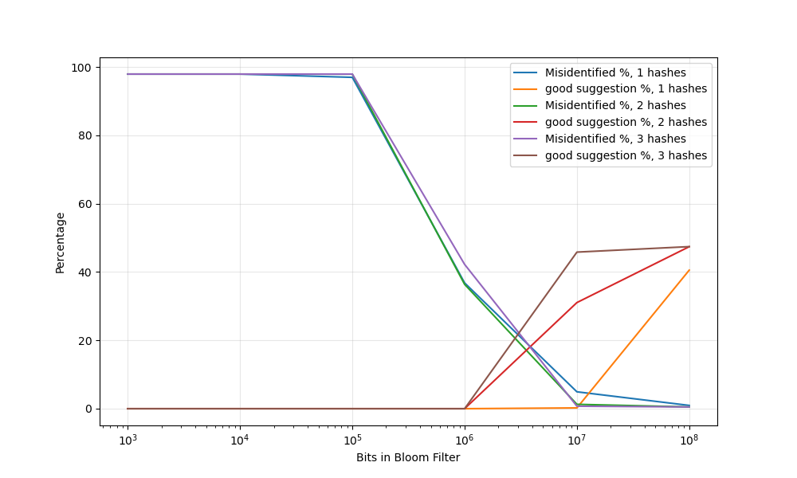
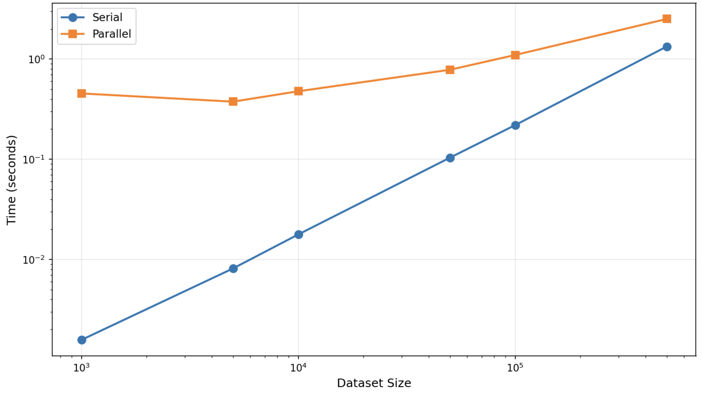
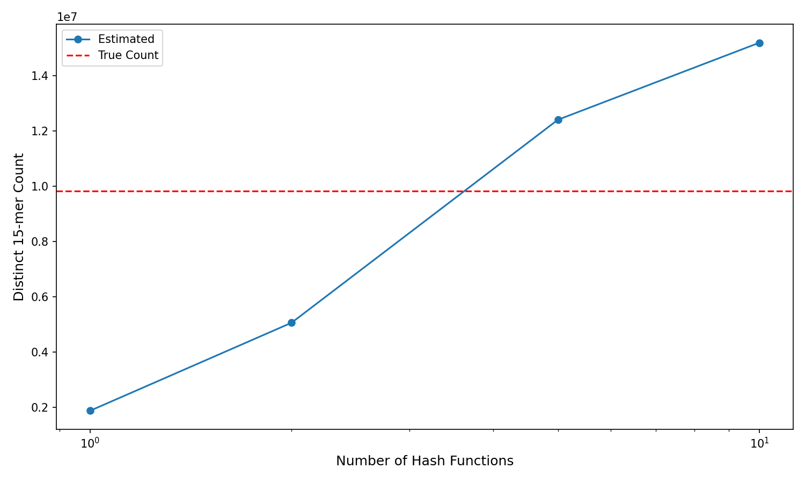

Excercise 1

1a.
```python
from bitarray import bitarray
from hashlib import sha3_256, sha256, blake2b
```
```python
# Create Bloom filter
size = 10**7  # used 1 million bits before but the outcome is not ideal
bloom_filter = bitarray(size)
bloom_filter.setall(0)

# Define hash functions
def my_hash1(s):
    return int(sha256(s.lower().encode()).hexdigest(), 16) % size

def my_hash2(s):
    return int(blake2b(s.lower().encode()).hexdigest(), 16) % size

def my_hash3(s):
    return int(sha3_256(s.lower().encode()).hexdigest(), 16) % size
```
```python
# Insert words into Bloom filter
with open('words.txt') as f:
    for line in f:
        word = line.strip()
        if word:
            bloom_filter[my_hash1(word)] = 1
            bloom_filter[my_hash2(word)] = 1
            bloom_filter[my_hash3(word)] = 1
```

1b.
```python
def suggest_corrections(typo):
    suggestions = []
    alphabet = 'abcdefghijklmnopqrstuvwxyz'
    
    for i in range(len(typo)):
        for char in alphabet:
            candidate = typo[:i] + char + typo[i+1:]
            
            # Check if candidate is in Bloom filter
            if (bloom_filter[my_hash1(candidate)] and 
                bloom_filter[my_hash2(candidate)] and 
                bloom_filter[my_hash3(candidate)]):
                suggestions.append(candidate)
    
    return suggestions
```
```python
import json
```
```python
# Load typos dataset
with open('typos.json') as f:
    typos_data = json.load(f)
```
```python
def evaluate_bloom_filter(typos_data):
    good_suggestions = 0
    total = len(typos_data)
    
    for typo, correct in typos_data:
        suggestions = suggest_corrections(typo)
        
        if len(suggestions) <= 3 and correct in suggestions:
            good_suggestions += 1
    
    accuracy = (good_suggestions / total) * 100
    print(f"Good suggestions: {good_suggestions}/{total} ({accuracy:.2f}%)")
    return accuracy
```
```python
# Run evaluation
evaluate_bloom_filter(typos_data)
```
Result: 

Bloom filter created with size: 10000000

Good suggestions: 22907/50000 (45.81%) (I've tried with higher bit, ie 10^8, but it only increases to ~47%)

1c.
```python
import matplotlib.pyplot as plt
```
```python
def experiment_bloom_filter(num_hashes, filter_size):
    bf = bitarray(filter_size)
    bf.setall(0)
    
    # Define hash functions
    def hash1(s):
        return int(sha256(s.lower().encode()).hexdigest(), 16) % filter_size
    
    def hash2(s):
        return int(blake2b(s.lower().encode()).hexdigest(), 16) % filter_size
    
    def hash3(s):
        return int(sha3_256(s.lower().encode()).hexdigest(), 16) % filter_size
    
    hash_funcs = [hash1, hash2, hash3][:num_hashes]
    
    # Insert words
    with open('words.txt') as f:
        for line in f:
            word = line.strip()
            if word:
                for hf in hash_funcs:
                    bf[hf(word)] = 1
    
    # Evaluate
    good = 0
    total_fps = 0
    total_checks = 0
    
    for typo, correct in typos_data:
        suggestions = []
        
        for i in range(len(typo)):
            for char in 'abcdefghijklmnopqrstuvwxyz':
                candidate = typo[:i] + char + typo[i+1:]
                total_checks += 1
                
                if all(bf[hf(candidate)] for hf in hash_funcs):
                    suggestions.append(candidate)
                    if candidate != correct:
                        total_fps += 1
        
        if len(suggestions) <= 3 and correct in suggestions:
            good += 1
    
    mis_rate = (total_fps / total_checks) * 100
    good_rate = (good / len(typos_data)) * 100
    
    return mis_rate, good_rate
```
```python
# Plot
sizes = [10**i for i in range(3, 9)]
hash_counts = [1, 2, 3]

plt.figure(figsize=(10, 6))

for num_hashes in hash_counts:
    mis_rates = []
    good_rates = []
    
    for size in sizes:
        mis, good = experiment_bloom_filter(num_hashes, size)
        mis_rates.append(mis)
        good_rates.append(good)
    
    plt.plot(sizes, mis_rates, label=f'Misidentified %, {num_hashes} hashes')
    plt.plot(sizes, good_rates, label=f'good suggestion %, {num_hashes} hashes')

plt.xscale('log')
plt.xlabel('Bits in Bloom Filter')
plt.ylabel('Percentage')
plt.legend()
plt.savefig("Performance_analysis_of_hashes.png")
plt.show()
```


Below used the model figure to answer 1c. (My result isn't ideal)

With 1 hash function, approximately 10^8 bits are necessary to achieve 85% good suggestions. A single hash function creates more collisions, requiring a larger filter to adequately reduce false positives.

With 2 hash functions, approximately 10^7 to 10^8 bits are needed to reach 85% good suggestions. Two hash functions provide better filtering than one by requiring two independent bit positions to match.

With 3 hash functions, approximately 10^7 bits are sufficient to achieve 85% good suggestions. Three hash functions minimize false positives most effectively by requiring three independent bit matches, allowing the smallest filter size to meet the performance target.


Excercise 2
```python
%%writefile sort_functions.py
def alg2_keyed(data, key):
    if len(data) <= 1:
        return data
    else:
        split = len(data) // 2
        left = iter(alg2_keyed(data[:split], key))
        right = iter(alg2_keyed(data[split:], key))
        result = []
        
        def get_key_value(item):
            if isinstance(item, dict):
                return item[key]
            else:
                return item[key]
        
        left_top = next(left)
        right_top = next(right)
        
        while True:
            if get_key_value(left_top) < get_key_value(right_top):
                result.append(left_top)
                try:
                    left_top = next(left)
                except StopIteration:
                    return result + [right_top] + list(right)
            else:
                result.append(right_top)
                try:
                    right_top = next(right)
                except StopIteration:
                    return result + [left_top] + list(left)


def merge_sorted_lists(left, right, key):
    result = []
    i = j = 0
    
    def get_key_value(item):
        if isinstance(item, dict):
            return item[key]
        else:
            return item[key]
    
    while i < len(left) and j < len(right):
        if get_key_value(left[i]) < get_key_value(right[j]):
            result.append(left[i])
            i += 1
        else:
            result.append(right[j])
            j += 1
    
    result.extend(left[i:])
    result.extend(right[j:])
    return result
```

2a.
```python
from sort_functions import alg2_keyed, merge_sorted_lists
```
```python
# Example 1
patient_data_tuples = [
    (105, "Patient E"),
    (102, "Patient B"),
    (104, "Patient D"),
    (101, "Patient A"),
    (103, "Patient C")
]

sorted_tuples = alg2_keyed(patient_data_tuples, key=0)
print(sorted_tuples)
print("Patient IDs in order:", [t[0] for t in sorted_tuples])
```
```python
# Example 2
patient_data_dicts = [
    {"patient_id": 105, "patient_data": "Patient E"},
    {"patient_id": 102, "patient_data": "Patient B"},
    {"patient_id": 104, "patient_data": "Patient D"},
    {"patient_id": 101, "patient_data": "Patient A"},
    {"patient_id": 103, "patient_data": "Patient C"}
]

sorted_dicts = alg2_keyed(patient_data_dicts, key="patient_id")
print(sorted_dicts)
print("Patient IDs in order:", [d["patient_id"] for d in sorted_dicts])
```

2b.
```python
import multiprocessing as mp
import time
import numpy as np
import matplotlib.pyplot as plt
```
```python
def alg2_keyed_parallel(data, key, num_processes=None):
    if num_processes is None:
        num_processes = mp.cpu_count()
    
    if len(data) <= 1:
        return data
    
    chunk_size = max(1, len(data) // num_processes)
    chunks = [data[i:i + chunk_size] for i in range(0, len(data), chunk_size)]
    
    with mp.Pool(processes=num_processes) as pool:
        sorted_chunks = pool.starmap(alg2_keyed, [(chunk, key) for chunk in chunks])
    
    while len(sorted_chunks) > 1:
        merged = []
        for i in range(0, len(sorted_chunks), 2):
            if i + 1 < len(sorted_chunks):
                merged.append(merge_sorted_lists(sorted_chunks[i], sorted_chunks[i + 1], key))
            else:
                merged.append(sorted_chunks[i])
        sorted_chunks = merged
    
    return sorted_chunks[0]
```
```python
dataset_sizes = [1000, 5000, 10000, 50000, 100000, 500000]
serial_times = []
parallel_times = []
speedups = []

print("Dataset Size | Serial Time | Parallel Time | Speedup")

for size in dataset_sizes:
    data = [(i, f"Data_{i}") for i in np.random.randint(0, size * 10, size)]
    
    start = time.time()
    alg2_keyed(data.copy(), key=0)
    serial_time = time.time() - start
    serial_times.append(serial_time)
    
    start = time.time()
    alg2_keyed_parallel(data.copy(), key=0)
    parallel_time = time.time() - start
    parallel_times.append(parallel_time)
    
    speedup = serial_time / parallel_time
    speedups.append(speedup)
    
    print(f"{size:>12} | {serial_time:>11.4f}s | {parallel_time:>13.4f}s | {speedup:>6.2f}x")
```
Result table:

  Dataset Size | Serial Time | Parallel Time | Speedup
  
        1000 |      0.0016s |        0.4542s |   0.00x
        
        5000 |      0.0081s |        0.3760s |   0.02x
        
       10000 |      0.0178s |        0.4775s |   0.04x
       
       50000 |      0.1037s |        0.7822s |   0.13x
       
      100000 |      0.2194s |        1.0988s |   0.20x
      
      500000 |      1.3353s |        2.5153s |   0.53x
```python
plt.figure(figsize=(10, 6))
plt.loglog(dataset_sizes, serial_times, 'o-', label='Serial')
plt.loglog(dataset_sizes, parallel_times, 's-', label='Parallel')
plt.xlabel('Dataset Size', fontsize=12)
plt.ylabel('Time (seconds)', fontsize=12)
plt.legend(fontsize=11)
plt.tight_layout()
plt.savefig('parallel_performance.png')
plt.show()
```



Excercise 3

3a.
```python
# Read FASTA file and extract chromosome 1
chr1_sequence = ""
in_chr1 = False

with open('human_g1k_v37.fasta', 'r') as f:
    for line in f:
        line = line.strip()
        if line.startswith('>'):
            if in_chr1:
                break
            if line.startswith('>1 ') or line.startswith('>1\t'):
                in_chr1 = True
        elif in_chr1:
            chr1_sequence += line.upper()

print(f"\nChromosome 1 length: {len(chr1_sequence):,} nucleotides")
```
Result: Chromosome 1 length: 12,376,584 nucleotides
```python
# Generate all overlapping 15-mers from chromosome 1
k = 15
valid_kmers = []

for i in range(len(chr1_sequence) - k + 1):
    kmer = chr1_sequence[i:i+k]
    
    # Exclude 15-mers with more than two Ns
    n_count = kmer.count('N')
    if n_count <= 2:
        valid_kmers.append(kmer)

print(f"Total 15-mers generated: {len(chr1_sequence) - k + 1:,}")
print(f"Valid 15-mers (≤2 Ns): {len(valid_kmers):,}")
```
Total 15-mers generated: 12,376,570

Valid 15-mers (≤2 Ns): 12,016,522
```python
# Count the true number of distinct 15-mers
distinct_kmers = set(valid_kmers)
true_distinct_count = len(distinct_kmers)

print(f"True number of distinct 15-mers: {true_distinct_count:,}")
```
Result: True number of distinct 15-mers: 9,828,898

3b.
```python
# Hash family implementation
M = 2**61 - 1
k = 15

# Encoding for nucleotides: c_i ∈ {1, 2, 3, 4, 5, 6}
# A=1, C=2, G=3, T=4, N=5, X=6
def encode_nucleotide(nuc):
    encoding = {'A': 1, 'C': 2, 'G': 3, 'T': 4, 'N': 5, 'X': 6}
    return encoding.get(nuc, 6)

def rolling_hash(sequence, a):
    hash_value = 0
    for i, nucleotide in enumerate(sequence):
        c_i = encode_nucleotide(nucleotide)
        hash_value = (hash_value + c_i * pow(a, k - 1 - i, M)) % M
    return hash_value
```

3c.
```python
import random
import numpy as np
```
```python
def estimate_distinct_count(kmers, num_hash_functions):
    # Generate random odd integers
    random.seed(42)
    a_values = []
    for _ in range(num_hash_functions):
        a = random.randrange(1, M, 2)
        a_values.append(a)
    
    min_hashes = [float('inf')] * num_hash_functions
    
    # Compute hashes for all k-mers
    for kmer in kmers:
        for j, a in enumerate(a_values):
            h = rolling_hash(kmer, a)
            if h < min_hashes[j]:
                min_hashes[j] = h
    
    # Normalize to [0,1] and compute estimates
    normalized_mins = [min_hash / M for min_hash in min_hashes]
    
    # Estimate distinct count for each hash function
    estimates = []
    for norm_min in normalized_mins:
        if norm_min > 0:
            estimate = 1.0 / norm_min - 1
            estimates.append(estimate)
    
    # Combine results
    final_estimate = np.mean(estimates)
    
    return final_estimate, estimates
```
```python
# Run experiments with different numbers of hash functions
hash_function_counts = [1, 2, 5, 10]
results = {}

for num_hashes in hash_function_counts:
    estimate, individual_estimates = estimate_distinct_count(valid_kmers, num_hashes)
    results[num_hashes] = estimate
    error = abs(estimate - true_distinct_count) / true_distinct_count * 100


print(f"{'Hash Functions':<20} {'Estimate':<20} {'Error %':<15}")
for num_hashes, estimate in results.items():
    error = abs(estimate - true_distinct_count) / true_distinct_count * 100
    print(f"{num_hashes:<20} {estimate:>15,.0f} {error:>14.2f}%")
```
Hash Functions | Estimate | Error %

1 | 1,868,870 | 80.99%

2 | 5,057,046 | 48.55%

5 | 12,410,740 | 26.27%

10 | 15,201,503 | 54.66%

3d.
```python
import matplotlib.pyplot as plt
```
```python
hash_counts = list(results.keys())
estimates = list(results.values())

plt.figure(figsize=(10, 6))
plt.plot(hash_counts, estimates, 'o-', label='Estimated')
plt.axhline(y=true_distinct_count, color='r', linestyle='--', label='True Count')
plt.xlabel('Number of Hash Functions', fontsize=12)
plt.ylabel('Distinct 15-mer Count', fontsize=12)
plt.legend()
plt.xscale('log')
plt.tight_layout()
plt.savefig('distinct_count_estimation.png')
plt.show()
```

The estimation accuracy improves as more hash functions are combined with 10 hashes as an outlier. With a single hash function, the estimate is highly variable and can have substantial error because it relies on a single random sample. As I increase the number of hash functions, the estimates become more stable through averaging. Using only a single hash makes the estimate unreliable because it's sensitive to the particular random parameter chosen.

3e.
For selecting values of parameter a, I used Python's random number generator to produce odd integers in the range [1, M) where M = 2^61 - 1. Odd integers are required to ensure the hash function has good distribution properties. The randomness ensures independence between different hash functions.

For optimizations, I implemented rolling hash computation that processes each k-mer in O(k) time by directly computing the polynomial hash. While removing the first character and adding the last would be O(1) per step, the current implementation is sufficient given that k=15 is small. I also pre-encoded nucleotides to integers and used Python's built-in pow(a, exp, M) for efficient modular exponentiation.


Excercise 4

4a.
The expansion of healthcare resources over the internet presents challenges. The digital divide remains a fundamental barrier. Rural areas often lack reliable broadband connectivity, while low-income populations may not afford devices or data plans necessary for telehealth services. For instance, during the COVID-19 pandemic, many elderly patients struggled to access virtual doctor appointments due to lack of smartphones or technical literacy, forcing them to forgo care or risk exposure by visiting clinics in person^1.
Security and trust issues also pose risks in digital health. Medical data breaches have exposed millions of patient records, while consumer wearables often lack robust encryption standards. The 23andMe data breach in 2023 compromised genetic information of 6.9 million users^2, demonstrating vulnerabilities in health data systems. Additionally, patients must trust that their fitness trackers and health apps are accurately measuring vital signs. There’s a significant concern given that many devices lack FDA approval or rigorous validation studies. False readings could lead to missed diagnoses or unnecessary anxiety^3.
Misinformation proliferates rapidly online, making it difficult for patients to distinguish credible medical advice from dangerous falsehoods. Social media algorithms amplify sensational health claims. For example, anti-vaccine misinformation on platforms like Facebook contributed to declining immunization rates and disease outbreaks. Even well-intentioned health information websites may present outdated protocols or fail to account for individual medical circumstances, leading patients to self-diagnose or pursue inappropriate treatments.
Legal and regulatory frameworks have not kept pace with technological advancement. Telehealth regulations create barriers for interstate care and limiting specialist access in underserved regions. Furthermore, liability questions arise when algorithms provide diagnostic suggestions or when remote monitoring devices fail to alert providers about critical changes in patient status.
These challenges require multifaceted solutions combining technological, policy reform, and digital literacy education to ensure that internet-based healthcare serves all populations equitably and safely.

Reference:

Care, University of North Carolina Health. “Almost Half of FDA-Approved Medical AI Devices Lack Clinical Validation Data.” News-Medical, August 26, 2024. https://www.news-medical.net/news/20240826/Almost-half-Of-FDA-approved-medical-AI-devices-lack-clinical-validation-data.aspx.

Ramsetty, Anita, and Cristin Adams. “Impact of the Digital Divide in the Age of COVID-19.” Journal of the American Medical Informatics Association : JAMIA 27, no. 7 (2020): 1147–48. https://doi.org/10.1093/jamia/ocaa078.

“Understanding the 23andMe Data Breach & Ensuring Cybersecurity.” Accessed October 11, 2025. https://www.risk-strategies.com/blog/understanding-the-23andme-data-breach-and-ensuring-cybersecurity.


4b.
My grandmother began using a continuous glucose monitor (CGM) last year to manage her Type 2 diabetes. The device transmits real-time blood sugar readings to her smartphone, allowing her to adjust insulin dosages and dietary choices throughout the day. This technology has improved her glucose control. However, the adoption process revealed barriers. Initially, she found the smartphone app overwhelming and required some level of deliberate. The device also required reliable internet connectivity, which is problematic when there’s internet fluctuation. Despite these challenges, I values the idea of continuous monitoring and the ability to share data directly with her endocrinologist during virtual appointments. From this, I saw how digital health tools offer benefits but require adequate technical support to be  accessible to elderly populations managing their health conditions.


4c.
The most challenging aspect was connecting systemic healthcare barriers to real-world personal experiences. While finding credible sources was straightforward, articulating abstract concepts like "the digital divide" is quite challenging. I struggled initially to avoid simply listing problems without providing sufficient examples that illustrated their real-world impact. Additionally, thinking example of personal connection to digital healthcare is surprisingly challenging. I was so used to the occurrence of digital product in my life, which overlooked the convenience and barriers that happened around me. This reflection helped me to slow down and appreciate how health informatics research have changed our medical system. Also, it is important for health informatics research to remain grounded in patient experiences.


Excercise 5

What is the data about? The "Diabetes 130-US hospitals for years 1999-2008" dataset contains 101,766 clinical records from diabetic patients across 130 US hospitals, including patient demographics, medication information, lab procedures, and hospital readmission outcomes within 30 days.

Where did you find it? The dataset is available from the UCI Machine Learning Repository at https://archive.ics.uci.edu/ml/datasets/diabetes+130-us+hospitals+for+years+1999-2008 as a direct CSV download.

What license was specified? The dataset is released under Creative Commons Attribution 4.0 International (CC BY 4.0) license, which permits reuse.

Why do you think it is interesting? Hospital readmissions for diabetic patients are a quality metric with financial penalties, making predictive analysis of readmission risk clinically valuable.

Give an example of two questions you could explore with this data. 1: "What clinical factors (medication changes, number of procedures, lab tests, length of stay) most strongly predict 30-day readmission for diabetic patients?" 2: "How do readmission rates vary across age groups when diabetic medications are adjusted during hospitalization versus when they remain unchanged?"
