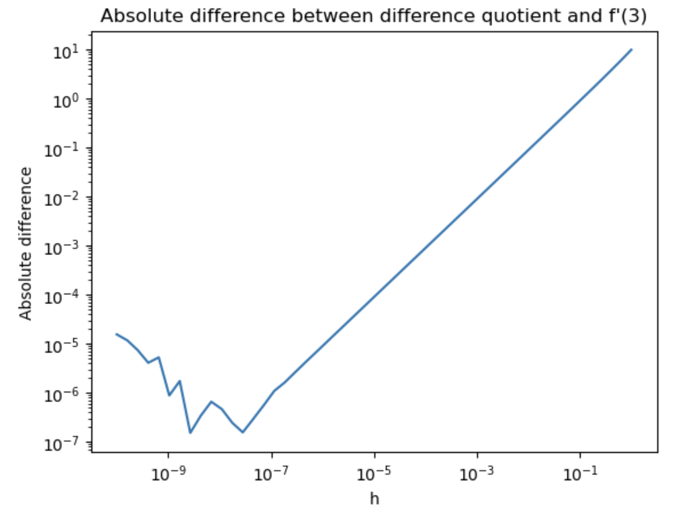
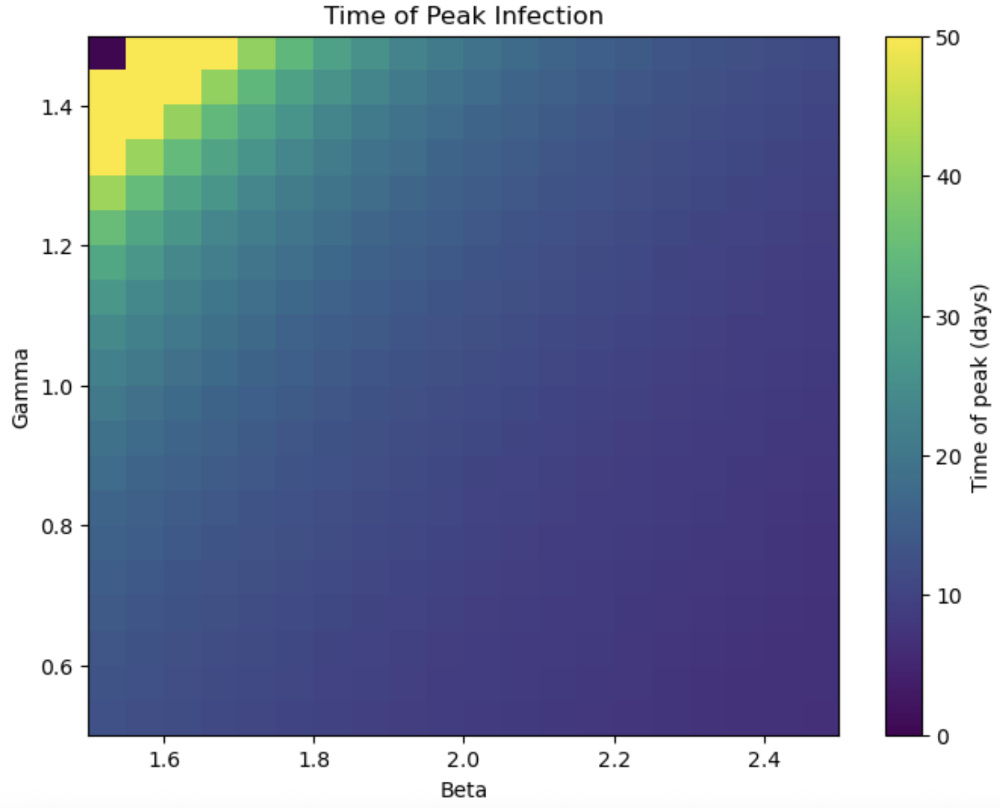
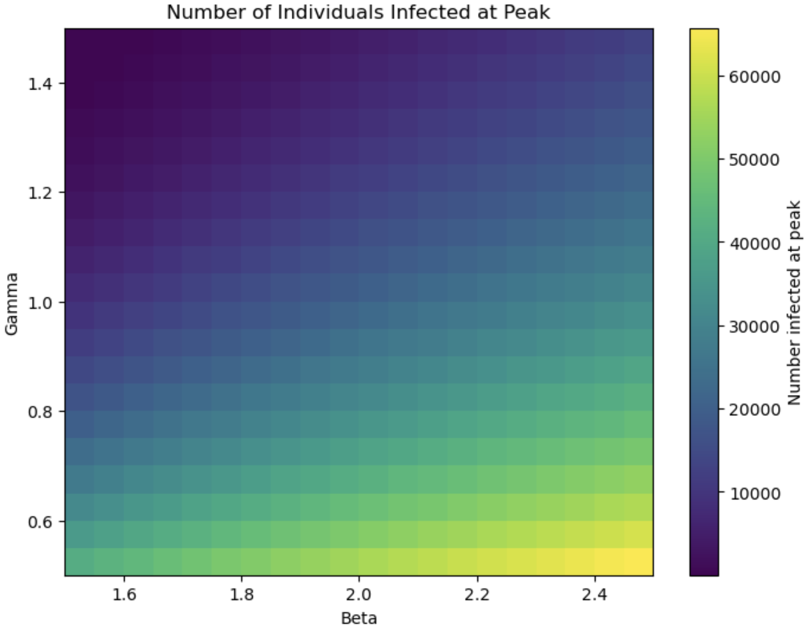

Excercise 1

1a.
```python
import requests
import time
import xml.etree.ElementTree as ET
```
```python
# Fetch Alzheimer's papers
url_alzheimer = "https://eutils.ncbi.nlm.nih.gov/entrez/eutils/esearch.fcgi?db=pubmed&term=Alzheimers+AND+2024[pdat]&retmax=1000&retmode=xml"
response_alzheimer = requests.get(url_alzheimer)
time.sleep(1)

# Fetch Cancer papers
url_cancer = "https://eutils.ncbi.nlm.nih.gov/entrez/eutils/esearch.fcgi?db=pubmed&term=cancer+AND+2024[pdat]&retmax=1000&retmode=xml"
response_cancer = requests.get(url_cancer)

# Parse PubMed IDs
alzheimer_tree = ET.fromstring(response_alzheimer.content)
alzheimer_ids = [id_elem.text for id_elem in alzheimer_tree.findall('.//Id')]

cancer_tree = ET.fromstring(response_cancer.content)
cancer_ids = [id_elem.text for id_elem in cancer_tree.findall('.//Id')]
```

1b.
```python
import json

# Process in batches
all_ids = alzheimer_ids + cancer_ids
batch_size = 200
papers_metadata = {}

for i in range(0, len(all_ids), batch_size):
    batch_ids = all_ids[i:i+batch_size]
    id_string = ",".join(batch_ids)
    
    url_fetch = f"https://eutils.ncbi.nlm.nih.gov/entrez/eutils/efetch.fcgi?db=pubmed&id={id_string}&retmode=xml"
    response_metadata = requests.get(url_fetch)
    
    metadata_tree = ET.fromstring(response_metadata.content)
    
    for article in metadata_tree.findall('.//PubmedArticle'):
        pmid_elem = article.find('.//PMID')
        if pmid_elem is not None:
            pmid = pmid_elem.text
            
            title_elem = article.find('.//ArticleTitle')
            title = ET.tostring(title_elem, encoding='unicode', method='text') if title_elem is not None else ""
            
            abstract_parts = []
            for abstract_text in article.findall('.//AbstractText'):
                text = ET.tostring(abstract_text, encoding='unicode', method='text')
                abstract_parts.append(text)
            abstract = " ".join(abstract_parts) if abstract_parts else ""
            
            query = "Alzheimer" if pmid in alzheimer_ids else "cancer"
            
            papers_metadata[pmid] = {
                "ArticleTitle": title,
                "AbstractText": abstract,
                "query": query
            }
    
    time.sleep(1)
```
```python
# Save to JSON
with open('papers_metadata.json', 'w', encoding='utf-8') as f:
    json.dump(papers_metadata, f, indent=2, ensure_ascii=False)
```

1c.
```python
alzheimer_set = set(alzheimer_ids)
cancer_set = set(cancer_ids)
overlap = alzheimer_set.intersection(cancer_set)

print(f"Number of overlapping papers: {len(overlap)}")
print(f"Overlapping PubMed IDs: {overlap}")
```
Number of overlapping papers: 4

Overlapping PubMed IDs: {'40395755', '40326981', '40949928', '40800467'}


1d.
Current method in 1b could ensure all sections are included. abstract is stored as one continuous string rather than a structured format (like a dictionary with separate keys for each section. For example for PMID:20966393, we can see subtitle rationale, objectives, etc. as the beginning of each paragraph, but the code stored all sections as a chunk.


Excercise 2
```python
!pip install torch transformers
from transformers import AutoTokenizer, AutoModel

# Load model and tokenizer
tokenizer = AutoTokenizer.from_pretrained('allenai/specter')
model = AutoModel.from_pretrained('allenai/specter')
```
```python
import json

# Load the papers dictionary
with open('papers_metadata.json', 'r', encoding='utf-8') as f:
    papers = json.load(f)
```
```python
import tqdm

# Create embeddings dictionary
embeddings = {}

for pmid, paper in tqdm.tqdm(papers.items()):
    data = paper["ArticleTitle"] + tokenizer.sep_token + paper["AbstractText"]
    inputs = tokenizer(
        data, padding=True, truncation=True, return_tensors="pt", max_length=512
    )
    result = model(**inputs)
    embeddings[pmid] = result.last_hidden_state[:, 0, :].detach().numpy()[0]

# turn our dictionary into a list
embeddings = [embeddings[pmid] for pmid in papers.keys()]
```
```python
from sklearn import decomposition
import pandas as pd

# Identify the first three PC in PCA
pca = decomposition.PCA(n_components=3)
embeddings_pca = pd.DataFrame(
    pca.fit_transform(embeddings),
    columns=['PC0', 'PC1', 'PC2']
)
embeddings_pca["query"] = [paper["query"] for paper in papers.values()]
```
```python
import matplotlib.pyplot as plt

# 3 subplots
fig, axes = plt.subplots(1, 3, figsize=(18, 5))

# PC0 vs PC1
for query in ['Alzheimer', 'cancer']:
    subset = embeddings_pca[embeddings_pca['query'] == query]
    axes[0].scatter(subset['PC0'], subset['PC1'], label=query, alpha=0.6)
axes[0].set_xlabel('PC0')
axes[0].set_ylabel('PC1')
axes[0].set_title('PC0 vs PC1')
axes[0].legend()

# PC0 vs PC2
for query in ['Alzheimer', 'cancer']:
    subset = embeddings_pca[embeddings_pca['query'] == query]
    axes[1].scatter(subset['PC0'], subset['PC2'], label=query, alpha=0.6)
axes[1].set_xlabel('PC0')
axes[1].set_ylabel('PC2')
axes[1].set_title('PC0 vs PC2')
axes[1].legend()

# PC1 vs PC2
for query in ['Alzheimer', 'cancer']:
    subset = embeddings_pca[embeddings_pca['query'] == query]
    axes[2].scatter(subset['PC1'], subset['PC2'], label=query, alpha=0.6)
axes[2].set_xlabel('PC1')
axes[2].set_ylabel('PC2')
axes[2].set_title('PC1 vs PC2')
axes[2].legend()

plt.tight_layout()
plt.savefig('PCA_plot')
plt.show()
```


The PCA demonstrates separation between Alzheimer's and cancer papers, particularly in the PC0 vs PC1 plot. This strong separation indicates that embeddings successfully capture the semantic and topical differences between these two medical research domains. The PC0 vs PC2 plot also shows good separation, though with slightly more overlap in the central region. However, the PC1 vs PC2 plot exhibits substantial mixing between the two categories, suggesting these components capture shared medical terminology rather than topic-specific distinctions. The key takeaway may be the PC0 effectively encoding the primary differences between Alzheimer's and cancer research, while higher components capture more shared characteristics across both domains.


Excercise 3
```python
import numpy as np
import matplotlib.pyplot as plt

def f(x):
    return x**3

f_prime_3 = 27
x0 = 3

# Create h values
h = np.logspace(-10, 0)

# Calculate difference quotient
difference_quotient = (f(x0 + h) - f(x0)) / h

# Calculate absolute difference
absolute_difference = np.abs(difference_quotient - f_prime_3)

# Plot on log-log scale
plt.loglog(h, absolute_difference)
plt.xlabel('h')
plt.ylabel('Absolute difference')
plt.title('Absolute difference between difference quotient and f\'(3)')
plt.show()
```

As h decreases from 1 toward approximately 10^-8, the absolute difference decreases linearly on the log-log plot, demonstrating that the difference quotient converges toward the true derivative value of 27 as h gets smaller. However, around h = 10^-8, the error reaches a minimum and then begins to increase as h continues to decrease. This may due to numerical precision limitations in floating-point arithmetic.


Excercise 4
```python
import numpy as np

# Define function
def sir_euler(S0, I0, R0, beta, gamma, T_max, dt=0.1):
    N = S0 + I0 + R0
    n_steps = int(T_max / dt)
    
    S = np.zeros(n_steps + 1)
    I = np.zeros(n_steps + 1)
    R = np.zeros(n_steps + 1)
    t = np.zeros(n_steps + 1)
    
    S[0] = S0
    I[0] = I0
    R[0] = R0
    
    for i in range(n_steps):
        t[i+1] = t[i] + dt
        S[i+1] = S[i] + dt * (-beta * S[i] * I[i] / N)
        I[i+1] = I[i] + dt * (beta * S[i] * I[i] / N - gamma * I[i])
        R[i+1] = R[i] + dt * (gamma * I[i])
    
    return t, I
```
```python
import matplotlib.pyplot as plt

# Initial conditions
N = 137000
S0 = N - 1
I0 = 1
R0 = 0
beta = 2
gamma = 1


t, I = sir_euler(S0, I0, R0, beta, gamma, T_max=50, dt=0.01)

# I < 1
idx_below_1 = np.where(I < 1)[0]
if len(idx_below_1) > 0:
    cutoff_idx = idx_below_1[0]
    t_plot = t[:cutoff_idx]
    I_plot = I[:cutoff_idx]
else:
    t_plot = t
    I_plot = I

plt.plot(t_plot, I_plot)
plt.xlabel('Time (days)')
plt.ylabel('Number of infected individuals')
plt.title('SIR Model: Infected individuals over time')
plt.show()
```
```python
# Find peak and peak number
peak_idx = np.argmax(I)
peak_time = t[peak_idx]
peak_infected = I[peak_idx]
print(peak_infected)
print(peak_time)
```
Peak time: 11.74 days

Peak infected: 21070 people
```python
# Parameter ranges
beta_values = np.linspace(1.5, 2.5, 20)
gamma_values = np.linspace(0.5, 1.5, 20)

# Set grid
peak_times = np.zeros((len(gamma_values), len(beta_values)))

for i, gamma in enumerate(gamma_values):
    for j, beta in enumerate(beta_values):
        t, I = sir_euler(S0, I0, R0, beta, gamma, T_max=50, dt=0.01)
        peak_times[i, j] = t[np.argmax(I)]

# Plot
plt.figure(figsize=(8, 6))
plt.imshow(peak_times, extent=[beta_values[0], beta_values[-1], gamma_values[0], gamma_values[-1]], 
           origin='lower', aspect='auto', cmap='viridis')
plt.colorbar(label='Time of peak (days)')
plt.xlabel('Beta')
plt.ylabel('Gamma')
plt.title('Time of Peak Infection')
plt.show()
```

```python
# Create grid
peak_infected_grid = np.zeros((len(gamma_values), len(beta_values)))

for i, gamma in enumerate(gamma_values):
    for j, beta in enumerate(beta_values):
        t, I = sir_euler(S0, I0, R0, beta, gamma, T_max=50, dt=0.01)
        peak_infected_grid[i, j] = np.max(I)

# Plot
plt.figure(figsize=(8, 6))
plt.imshow(peak_infected_grid, extent=[beta_values[0], beta_values[-1], gamma_values[0], gamma_values[-1]], 
           origin='lower', aspect='auto', cmap='viridis')
plt.colorbar(label='Number infected at peak')
plt.xlabel('Beta')
plt.ylabel('Gamma')
plt.title('Number of Individuals Infected at Peak')
plt.show()
```


Excercise 5
